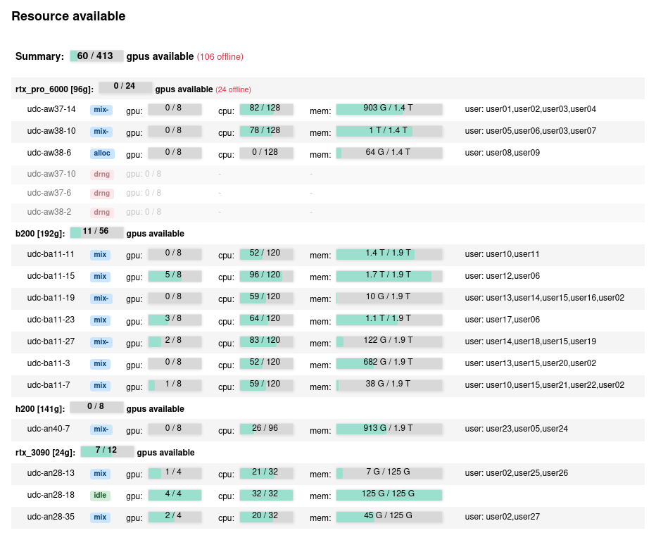
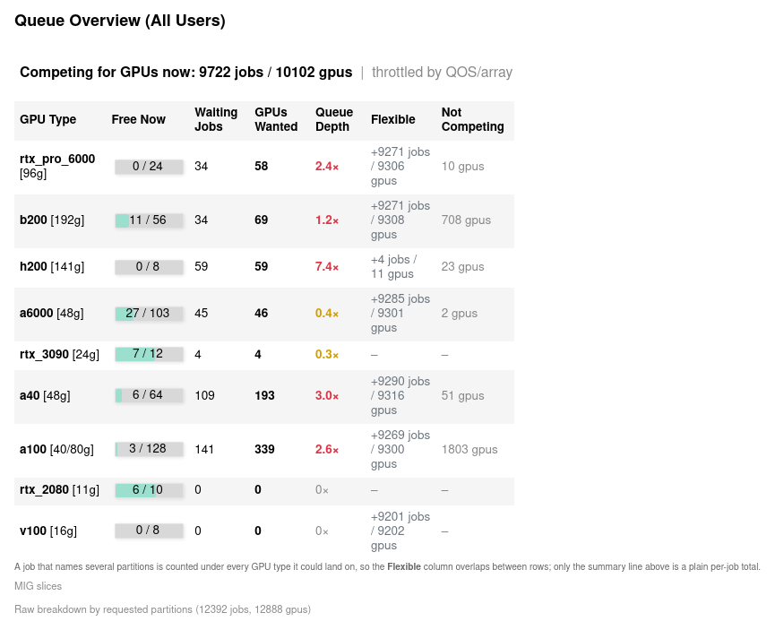
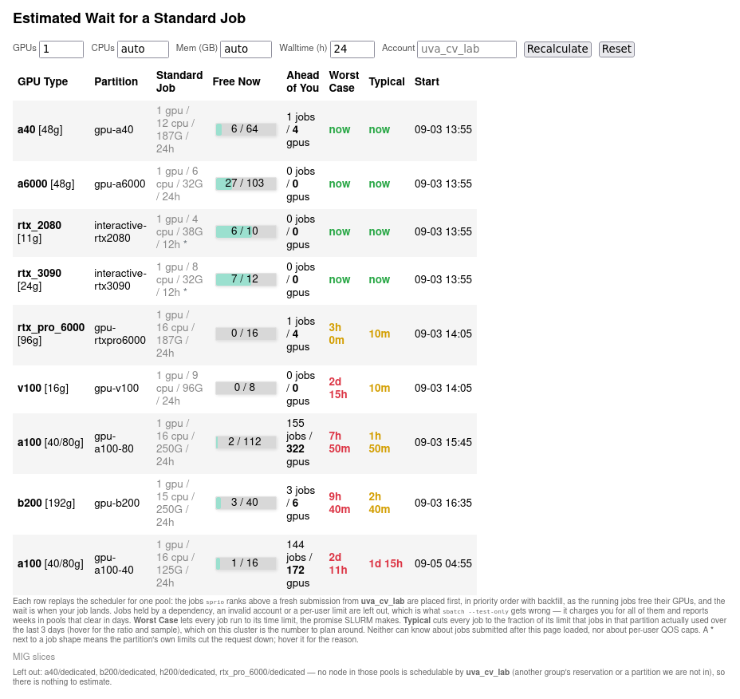
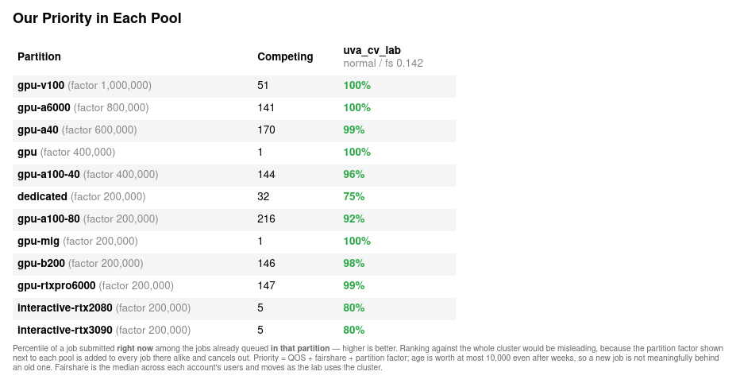
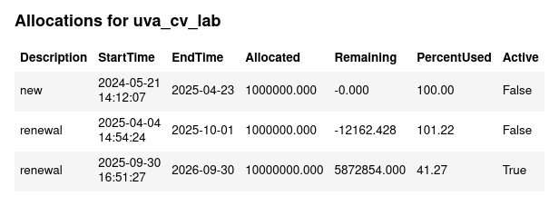

# Slurm Website Monitor for UVA Rivanna
A website-based resource monitor for [SLURM](https://slurm.schedmd.com/documentation.html) systems, tailored specifically for the UVA Rivanna computing environment.

This project extends the original implementation developed for the [Visual Geometry Group](https://www.robots.ox.ac.uk/~vgg/), Oxford, with enhancements and customizations to better serve the specific needs of our research group at the University of Virginia.

## Features
- Parses the results from the `sinfo` command every 1 seconds to update CPU/GPU resource usage.
- Hosts statistics on an internally accessible webpage, providing a convenient overview of system status.

## Interface

The page is one scrolling dashboard. Each block below is a collapsible section that
refreshes on its own over AJAX, so a slow section never blocks the rest. A dark mode
toggle, an "Unfold All" button and a manual "Update All" button sit in the header.

### Resource available

Live GPU, CPU and memory occupancy for every node, grouped by GPU type and sorted by
computing power, with a state badge per node (`idle`, `mix`, `alloc`, `drng`, `resv`)
and the users currently on it. Offline nodes are dimmed and counted separately.



*Trimmed to the first four GPU types; the real page lists all of them. Usernames are
replaced with placeholders in this screenshot.*

### Queue Overview (All Users)

Cluster-wide contention per GPU type: how many GPUs are free, how many jobs are
waiting, how many GPUs they want, and the resulting queue depth. Jobs that could land
on more than one GPU type are counted under each, so the `Flexible` column overlaps
between rows; jobs held by a dependency or a QOS/array limit are split out as
`Not Competing` rather than inflating the numbers.



### Estimated Wait for a Standard Job

Answers "if I submit right now, when do I start?" for each GPU pool. Enter a job shape
(GPUs, CPUs, memory, walltime, account) and each row replays the scheduler for that
pool: every pending job `sprio` ranks above a fresh submission of yours is placed
first, in priority order with backfill, as running jobs free their GPUs.
`Worst Case` lets every job run to its time limit; `Typical` cuts each job to the
fraction of its limit that jobs in that partition actually used over the last 3 days.



### Our Priority in Each Pool

Where a job submitted right now would rank among the jobs already queued *in that
partition*. Ranking against the whole cluster would be misleading, because the
partition factor shown next to each pool is added to every job in it alike.



### Allocations

The lab's service-unit allocations: allocated, remaining, percent used, and which one
is currently active.



## News
- [09/03/2026]: Add estimated wait time, queue overview, per-pool priority, collapsible sections, and B200 / RTX PRO 6000 partitions.
- [08/12/2025]: Add Multi-Instance GPU partition
- [04/29/2025]: Add disk quota, H200 partition, and manual update button.
- [10/31/2024]: Add allocations.
- [10/31/2024]: Launched customized version for UVA Rivanna.

## Installation
To install necessary dependencies, run:
```
pip install -r requirements.txt
```

## Usage
To launch the web monitor:
```
python app.py --host localhost --port 8080
```
Access the website at `localhost:8080`. Adjust the host and port as needed for your setup.

Modify the [index.html](index.html) to customize the header, footer, and formatting to suit your group's preferences.

## Command-Line Tool
For command-line usage:
```
python slurm_web/slurm_gpustat.py
```

Alternatively, add this alias to your `.bash_profile`:
```
alias slurm_gpustat='python ~/slurm_web/slurm_gpustat.py'
```

To view the statistics of only the available resources, run:
```
python available_resources.py 
```

## Credits
This project is based on the original `slurm_gpustat` tool developed by [Samuel Albanie](https://github.com/albanie/slurm_gpustat) and `slurm_web
` developed by [Tengda Han](https://tengdahan.github.io/). It has been modified and maintained for the UVA Rivanna system by the UVA CV Lab, with the aim of providing enhanced monitoring tools for Rivanna.

## Reference
Further documentation and updates can be found at the original [slurm_gpustat repository](https://github.com/albanie/slurm_gpustat).
