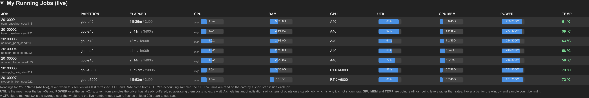

# Slurm Website Monitor for UVA Rivanna
A website-based resource monitor for [SLURM](https://slurm.schedmd.com/documentation.html) systems, tailored specifically for the UVA Rivanna computing environment.

This project extends the original implementation developed for the [Visual Geometry Group](https://www.robots.ox.ac.uk/~vgg/), Oxford, with enhancements and customizations to better serve the specific needs of our research group at the University of Virginia.

## Features
- Parses the results from the `sinfo` command every 1 seconds to update CPU/GPU resource usage.
- Hosts statistics on an internally accessible webpage, providing a convenient overview of system status.

## Interface

The page is one scrolling dashboard. Each block below is a collapsible section that
refreshes on its own over AJAX, so a slow section never blocks the rest. A dark mode
toggle, an "Unfold All" button and a manual "Update All" button sit in the header.

An **account picker** sits in the header as well. Allocations, the wait estimate, the
per-pool priority and the lab queue all follow whichever account is picked, so the page
shows one account at a time rather than every account at once; the choice is remembered
across visits. The accounts on offer come from `LAB_ACCOUNTS` in `app.py`, or from the
`RIVANNA_ACCOUNTS` environment variable as a comma separated list.

### My Running Jobs (live)

What your own running jobs are actually doing: cores busy against cores reserved,
resident memory against memory reserved, and per GPU its utilisation, memory, power
draw and temperature. CPU and RAM come from one `sstat` call; the GPU figures are read
on the card by a short step inside each job (`srun --overlap`), which is also what
limits the reading to the GPUs that job holds.

The GPU figures are averages, not snapshots: one `utilization.gpu` reading covers
1/6--1s and swings between 45% and 100% on a steady job, so `gpu_probe.py` asks NVML for
the samples the driver has *already* buffered -- ~5s of utilisation, ~2.4s of power, at
no extra wait. Memory and temperature stay point readings. Hover any bar for its window
and sample count.

"My" means the account running `app.py`; SLURM will not report another user's job steps.
Each refresh starts a step inside every GPU job, so the panel is fetched only while its
section is open.



*Trimmed to the first seven jobs; ids, job names and the owner are placeholders.*

### Resource available

Live GPU, CPU and memory occupancy for every node, grouped by GPU type and sorted by
computing power, with a state badge per node (`idle`, `mix`, `alloc`, `drng`, `resv`)
and the users currently on it. Offline nodes are dimmed and counted separately.


*Trimmed to the first four GPU types; the real page lists all of them. Usernames are
replaced with placeholders in this screenshot.*

### Queue Overview (All Users)

Cluster-wide contention per GPU type: how many GPUs are free, how many jobs are
waiting, how many GPUs they want, and the resulting queue depth. Jobs that could land
on more than one GPU type are counted under each, so the `Flexible` column overlaps
between rows; jobs held by a dependency or a QOS/array limit are split out as
`Not Competing` rather than inflating the numbers.


### Estimated Wait for a Standard Job

Answers "if I submit right now, when do I start?" for each GPU pool. Enter a job shape
(GPUs, CPUs, memory, walltime; the account comes from the header picker) and each row
replays the scheduler for that pool: every pending job `sprio` ranks above a fresh submission of yours is placed
first, in priority order with backfill, as running jobs free their GPUs.
`Worst Case` lets every job run to its time limit; `Typical` cuts each job to the
fraction of its limit that jobs in that partition actually used over the last 3 days.


### Priority in Each Pool

Where a job submitted right now under the picked account would rank among the jobs
already queued *in that partition*. Ranking against the whole cluster would be misleading, because the
partition factor shown next to each pool is added to every job in it alike.


### Allocations

The picked account's service-unit allocations: allocated, remaining, percent used, and
which one is currently active. The `allocations` command only reports a balance to
members of the account, so for an account you are not in the section says so instead of
showing an empty table.


## News
- [09/17/2026]: Add a live per-job panel: CPU, RAM, GPU utilisation, GPU memory, power and temperature for your own running jobs, with the GPU figures averaged over a few seconds of the driver's own samples.
- [09/10/2026]: Add the header account picker, and keep panels up when SLURM or the login node has a bad moment.
- [09/03/2026]: Add estimated wait time, queue overview, per-pool priority, collapsible sections, and B200 / RTX PRO 6000 partitions.
- [08/12/2025]: Add Multi-Instance GPU partition
- [04/29/2025]: Add disk quota, H200 partition, and manual update button.
- [10/31/2024]: Add allocations.
- [10/31/2024]: Launched customized version for UVA Rivanna.

## Installation
To install necessary dependencies, run:
```
pip install -r requirements.txt
```

## Usage
To launch the web monitor:
```
python app.py --host localhost --port 8080
```
Access the website at `localhost:8080`. Adjust the host and port as needed for your setup.

Modify the [index.html](index.html) to customize the header, footer, and formatting to suit your group's preferences.

## Running It Through Open OnDemand

`python app.py` in a terminal stops when that terminal closes, and the page it serves
sits on a login node's internal address, reachable only through an SSH tunnel. Open
OnDemand can serve it at a NetBadge-protected URL instead, and a few lines in your shell
startup file keep it running without starting it by hand.

It has to run on a login node and as you: every panel comes from SLURM commands, and
*My Running Jobs* reads your jobs from inside them.

### The URL

OnDemand forwards a port on a cluster node at

```
https://ood.hpc.virginia.edu/rnode/<node>/<port>/
```

It is `rnode`; `/node/...` answers *Not Found* on Rivanna. `hostname` prints the node,
and the page's own title shows the node and port it is serving from. Login nodes are
handed out round-robin, so the node, and with it the URL, can differ from one session
to the next.

### Pick a port of your own

Two people on the same login node cannot both listen on 2070. Choose another port above
1024 and use it for `RIVMON_PORT` below.

### Start it when you log in

Rivanna does not let users run `crontab`, `at` or a lingering `systemd --user` service,
so the way to keep it up is a hook in your shell's startup file. Save this as
`~/.config/rivmon.sh`, with `RIVMON_DIR` set to your clone and `RIVMON_PORT` to your
port:

```sh
RIVMON_DIR="$HOME/rivanna_resource"   # where you cloned this repository
RIVMON_PORT=2070                      # a port of your own; see above

# The monitor's URL on this node, with a warning if you are not serving it.
rivmon() {
    printf 'https://ood.hpc.virginia.edu/rnode/%s/%s/\n' "$(hostname)" "$RIVMON_PORT"
    ss -lntpH "sport = :$RIVMON_PORT" 2>/dev/null | grep -q 'users:((' || {
        echo "rivmon: you are not serving port $RIVMON_PORT on $(hostname)" >&2
        return 1
    }
}

if [[ $- == *i* ]] && [ -d "$RIVMON_DIR" ]; then
    if ss -lntpH "sport = :$RIVMON_PORT" 2>/dev/null | grep -q 'users:(('; then
        echo "Rivanna monitor: $(rivmon)"
    elif ss -lntH "sport = :$RIVMON_PORT" 2>/dev/null | grep -q .; then
        echo "Rivanna monitor: port $RIVMON_PORT is taken by someone else on" \
             "$(hostname); set RIVMON_PORT to another" >&2
    else
        ( cd "$RIVMON_DIR" && setsid nohup python app.py --host 0.0.0.0 \
            --port "$RIVMON_PORT" >> "$RIVMON_DIR/app.log" 2>&1 < /dev/null & ) \
            >/dev/null 2>&1
        echo "Rivanna monitor: https://ood.hpc.virginia.edu/rnode/$(hostname)/$RIVMON_PORT/"
    fi
fi
```

Then source it from `~/.bashrc`, and from your `.zshrc` too if you use zsh:

```sh
[ -f "$HOME/.config/rivmon.sh" ] && . "$HOME/.config/rivmon.sh"
```

Each interactive shell now starts the monitor if you are not already running it on that
node, and prints its URL. `rivmon` prints it again later.

- `setsid` gives the server a session of its own, so logging out does not stop it. If
  the login node reboots, it comes back the next time you open a shell there.
- Nothing runs outside an interactive shell, so `scp`, `rsync` and `ssh host command`
  are unaffected.
- Only a listener you own counts as running. If someone else holds the port on that
  node, you are told so rather than shown their URL as yours.
- The `python` on your `PATH` needs the packages in `requirements.txt`.
- Every login node you use keeps its own copy running, so at most one per node.
- Output goes to `app.log` in the repository, which git ignores.

## Command-Line Tool
For command-line usage:
```
python slurm_web/slurm_gpustat.py
```

Alternatively, add this alias to your `.bash_profile`:
```
alias slurm_gpustat='python ~/slurm_web/slurm_gpustat.py'
```

To view the statistics of only the available resources, run:
```
python available_resources.py 
```

## Credits
This project is based on the original `slurm_gpustat` tool developed by [Samuel Albanie](https://github.com/albanie/slurm_gpustat) and `slurm_web
` developed by [Tengda Han](https://tengdahan.github.io/). It has been modified and maintained for the UVA Rivanna system by the UVA CV Lab, with the aim of providing enhanced monitoring tools for Rivanna.

## Reference
Further documentation and updates can be found at the original [slurm_gpustat repository](https://github.com/albanie/slurm_gpustat).
