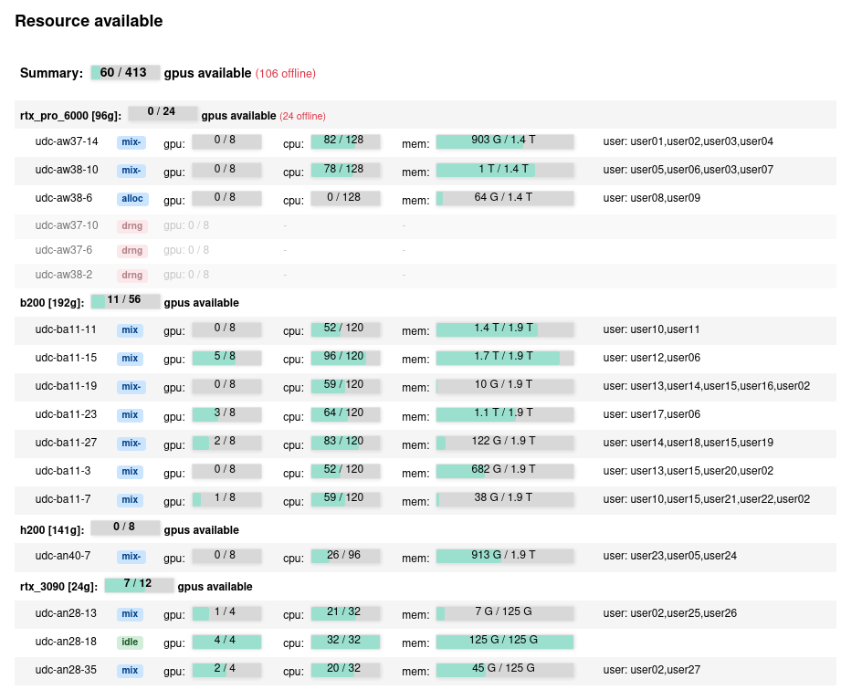

# Rivanna Monitor

One page that shows what UVA's Rivanna cluster is doing, where your account stands in the
queue, and what your own jobs are using.



## Quick start

On a Rivanna login node:

```sh
git clone https://github.com/UVA-Computer-Vision-Lab/rivanna_resource.git
cd rivanna_resource
pip install -r requirements.txt
python app.py
```

Then open it in your browser through Open OnDemand. No SSH tunnel, just your NetBadge
login:

```
https://ood.hpc.virginia.edu/rnode/<node>/2070/
```

`<node>` is what `hostname` prints on the node where you started it.

**Don't want to start it by hand every time?** A small login hook keeps it running and
prints the URL for you. See [Deployment](docs/deployment.md).

## What's on the page

| Panel | What it tells you |
| --- | --- |
| **My Running Jobs** | CPU, memory, GPU utilisation, power and temperature of your own jobs, live |
| **Resource available** | Every node: GPUs, CPUs, memory, and who is on it |
| **GPU Leaderboard** | Who holds how many GPUs, with your row highlighted |
| **Disk Quota** | Your home, scratch and research storage |
| **Allocations** | Your account's service units |
| **Queue Overview** | How contended each GPU type is |
| **Estimated Wait** | When a job submitted now would start, per GPU pool |
| **Priority** | Where your account ranks in each pool |
| **Waiting Queue** | Your lab's pending jobs |

Pick your account in the header and the account panels follow it.
Screenshots and details: [Panels](docs/panels.md).

## Settings

```sh
RIVANNA_ACCOUNTS=my_lab,other_lab python app.py    # accounts offered in the header
```

All settings: [Deployment › Settings](docs/deployment.md#settings).

## In the terminal

```sh
python slurm_gpustat.py          # GPU usage across the cluster
python available_resources.py    # only what is free
```

## What's new

- **2026-09-24** Estimated Wait reuses the last start of repeated array tasks and
  searches the earliest part of the 30-day window first, speeding up large queues.
  Waiting Queue shows requested GPUs per job instead of node count.
- **2026-09-18** Refreshes about 3× faster, your leaderboard row is highlighted, and the
  page works through Open OnDemand.
- **2026-09-17** Live CPU, memory and GPU panel for your own running jobs.
- **2026-09-10** Account picker; panels stay up when SLURM has a bad moment.
- **2026-09-03** Wait estimate, queue overview, per-pool priority, B200 and RTX PRO 6000.
- **2025-08-12** Multi-Instance GPU partition.
- **2025-04-29** Disk quota, H200 partition, manual update button.
- **2024-10-31** Allocations; first release for Rivanna.

## Troubleshooting

| Problem | Root cause | Solution and lesson |
| --- | --- | --- |
| *Update All* spends several seconds at 8/9 while Estimated Wait loads | The scheduler replay expanded a large pending job array and searched the full 30-day window for every copy, even when a later copy could not start before an earlier one. | The replay now starts each repeated task at the previous copy's earliest start, searches time in growing chunks, and stops retrying copies after one cannot fit. If this checkout was updated while the app was running, restart `python app.py` to load the change. Profile the replay before blaming `sbatch --test-only`; its checks were short in the 2026-09-24 investigation. |

On 2026-09-24, a pending array of about 1,523 three-day tasks made this panel the
slowest. The revised replay matched the old start times for every pool on the same live
SLURM snapshot. In a nine-panel HTTP refresh, Estimated Wait fell from 7.58 s to 3.39 s;
the exact time depends on the current queue.

## Credits

Built on [`slurm_gpustat`](https://github.com/albanie/slurm_gpustat) by Samuel Albanie and
`slurm_web` by [Tengda Han](https://tengdahan.github.io/), written for the
[Visual Geometry Group](https://www.robots.ox.ac.uk/~vgg/), Oxford. Maintained by the UVA
Computer Vision Lab. [MIT licensed](LICENSE).
